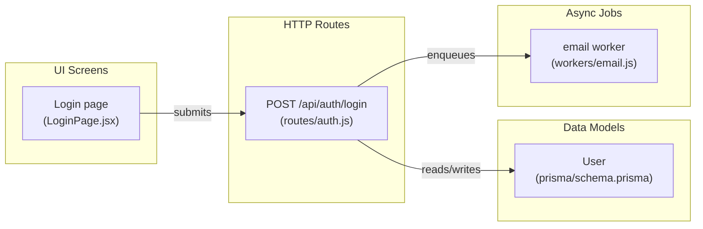

# AgDR-0035 — Per-feature Mermaid sub-graphs as a dedicated `/feature-diagram` skill

> In the context of a feature inventory that already enumerates routes / models / jobs / screens per feature, facing a missing "slice the system by feature" view that neither `/c4` (whole-system topology), `/dfd` (data flows), `/process` (BPMN control flow), nor `/journey` (product-facing user flow HTML) covers, I decided to ship a new `/feature-diagram <feature-slug>` skill that emits a Mermaid `flowchart LR` per feature, to keep `/extract-features` single-purpose and `/journey` product-facing, accepting one additional slash command in the skill surface.

## Context

`/extract-features` (the six-axis inventory scanner) writes a consolidated feature matrix at `projects/<name>/feature-inventory.md`. Each row already enumerates the HTTP routes, data models, async jobs, and UI screens that participate in that feature. The architecture-doc family slices the system multiple ways:

- `/c4` — static system topology (L1 + L2). Whole-system, not per-feature.
- `/dfd` — data flows + trust boundaries. Whole-system; consumed by `/threat-model`.
- `/process` — dynamic control flow (BPMN). Per-process, not per-feature.
- `/journey` — single-feature HTML preview. Product-facing — user flow with modal-per-page, not architectural.

None of them answers *"which routes + models + jobs + screens participate in **this one feature**?"* The data is there in the inventory; the per-feature visual slice isn't emitted.

Issue [me2resh/apexyard#288](https://github.com/me2resh/apexyard/issues/288) presented three options for *which skill owns the per-feature diagram*:

| Option | Pro | Con |
|--------|-----|-----|
| 1. Extend `/journey` — add a Mermaid sibling output to the HTML | Locality of feature-scoped artefacts | `/journey`'s scope is product-facing user flow; per-feature architectural slice is a different audience. Conflates two artefact types under one skill. |
| 2. Add `--diagrams` flag to `/extract-features` | Co-locates discovery + emit; minimal skill-count growth | Turns a single-purpose inventory skill into a multi-output skill; the inventory writes ONE file, this would write 1 + N |
| 3. New skill `/feature-diagram <feature-slug>` | Clean single-purpose; matches sibling pattern (`/c4`, `/dfd`, `/process`, `/journey` — each owns one artefact type) | One more skill in the surface (48 → 49) |

## Options Considered

| Option | Pros | Cons |
|--------|------|------|
| 1. Extend `/journey` | Locality with the other per-feature artefact | Mixes product-facing user-flow audience with architectural-slice audience; widens `/journey`'s remit beyond user flows |
| 2. `--diagrams` flag on `/extract-features` | Reuses the discovery axes; no new skill | Inventory is a one-file scan; diagrams are N files; the two have different re-run cadence (inventory = one-off scan, diagrams = regenerate when arch changes); flag-mode skills are harder to discover than first-class skills |
| 3. New skill `/feature-diagram <feature-slug>` | Single-purpose; consumes the inventory file as input; re-run cadence matches `/c4` / `/dfd` (refresh on arch change); discoverable as a peer slash command | One additional skill; need a new SKILL.md, tests, lint wrapper |

## Decision

Chosen: **Option 3 — new skill `/feature-diagram <feature-slug>`**, because:

- The architecture-doc family already follows a **one skill, one artefact** convention (`/c4` → C4 markdown, `/dfd` → DFD markdown + Dragon JSON, `/process` → BPMN, `/journey` → HTML). Per-feature Mermaid is its own artefact type; it deserves its own skill.
- `/extract-features` is documented as a **one-off scan**, "not a recurring audit". The per-feature diagrams are **refreshable on architecture change** (same cadence as `/c4`). Conflating those two cadences under one skill would muddle the re-run semantics.
- `/journey` is explicitly **product-facing** (UX Designer role activates). Per-feature architectural slicing is **architect-facing** (Tech Lead audience). Different audiences, different artefacts.
- The cost is one additional skill, one SKILL.md, one tests/smoke.sh, and one lint.sh wrapper — same shape as `/c4` / `/dfd`. No new helper functions, no new portfolio config.

## Diagram shape

The emitted Mermaid is a `flowchart LR` (left-to-right) with four subgraphs — one per axis — and inferred edges between them. The flowchart shape matches `/dfd`'s precedent (Mermaid `flowchart` with `subgraph` blocks for grouping), not `/c4`'s `C4Container` shape (which is system-wide, not per-feature).

**Edge inference rules** (consumed from the inventory row's columns):

| Relation | Edge | Label |
|----------|------|-------|
| Screen → Route | `screen --> route` | `"submits"` (when the screen has a form) / `"calls"` (when the screen reads) |
| Route → Model | `route --> model` | `"reads/writes"` |
| Route → Job | `route --> job` | `"enqueues"` |
| Job → Model | `job --> model` | `"reads/writes"` (if the inventory row mentions both) |

Empty axes are **rendered with a placeholder node** so the subgraph stays visible (a feature with no jobs prints `Jobs(empty)` rather than dropping the subgraph entirely). This keeps the four-quadrant shape constant across features so the reader's eye doesn't have to re-orient.

## Re-run UX

Mirror `/c4` and `/dfd` exactly:

- **First run**: write directly.
- **File exists, no `--force`**: prompt the operator with a default-no offer to overwrite. The existing file may have been hand-edited.
- **`--force`**: overwrite without prompting; print a one-line `Overwriting <path>` to stderr.
- **Footer signature**: every generated file ends with `_Generated by /feature-diagram on YYYY-MM-DD_` so future readers know it's regenerable.

## Inventory back-link

After every per-feature write, the skill updates `feature-inventory.md` to link each feature row to its `features/<slug>.md` file. The link goes in the existing `Feature` column (turning the verb-phrase into a markdown link) — adding a sixth matrix column for "Diagram" was rejected because it bloats the table; the linkable verb-phrase is a no-cost annotation.

If the inventory file is missing, the skill stops with a helpful error pointing at `/extract-features` — it's a hard dependency, not a soft one.

## Consequences

- One additional skill in the surface (49 total).
- The architecture-doc family grows by one artefact type (per-feature slice). Documented in `CLAUDE.md` skills list and `templates/architecture/README.md`.
- `/extract-features`'s SKILL.md grows a one-line "see also: `/feature-diagram` for the per-feature view" pointer.
- Re-running `/feature-diagram <slug>` after an architecture change refreshes one feature's diagram without re-scanning the whole inventory. Re-scanning is `/extract-features`'s job; the diagram skill is downstream.
- No new portfolio config keys, no new helper libraries — uses the existing `portfolio_projects_dir` and the shared `_lib-mermaid-lint.sh` validator.

## Artifacts

- `.claude/skills/feature-diagram/SKILL.md` — skill spec
- `.claude/skills/feature-diagram/lint.sh` — Mermaid lint wrapper (one-line thin wrapper around `_lib-mermaid-lint.sh`, same shape as `/c4` / `/dfd`)
- `.claude/skills/feature-diagram/tests/smoke.sh` — fixture-driven smoke covering inventory parsing + per-feature emit + Mermaid lint + missing-slug error
- `templates/architecture/README.md` — updated to list per-feature diagrams alongside the existing five templates
- `CLAUDE.md` skills table — `/feature-diagram` row added
- `.claude/skills/extract-features/SKILL.md` — "see also" pointer added
- Issue: [me2resh/apexyard#288](https://github.com/me2resh/apexyard/issues/288)
