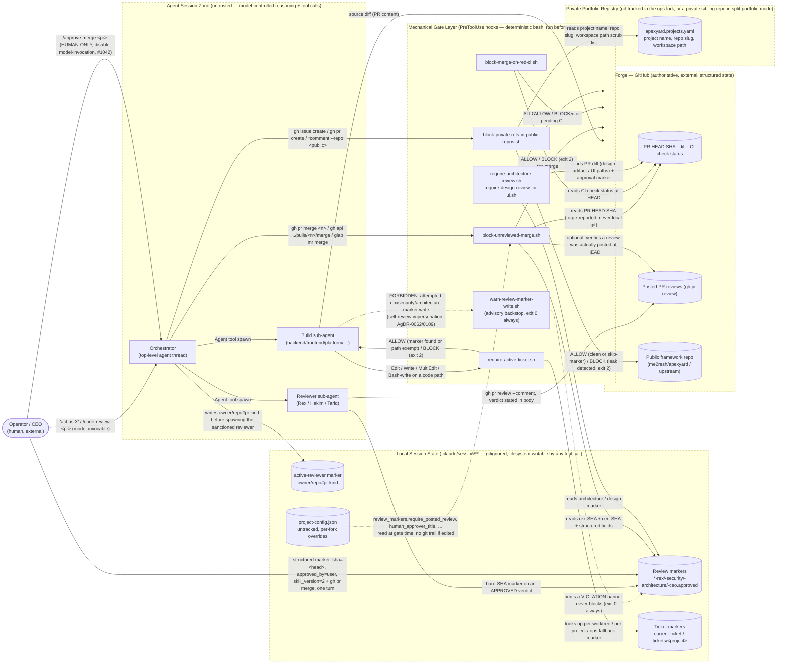

<!-- Source: ApexYard · docs/architecture/dfd.md · github.com/me2resh/apexyard · MIT -->

# Data Flow Diagram — ApexYard Control Plane (SDLC Enforcement Machinery)

> **Scope note.** This is the **framework's own** DFD — not a managed project's. It maps the machinery
> that enforces the SDLC gates described in `.claude/rules/workflow-gates.md` and `.claude/rules/pr-workflow.md`:
> the PreToolUse hooks, the review-marker files they read and write, and the boundary between local
> session state and the forge (GitHub). It is the STRIDE input for [`../security/threat-model.md`](../security/threat-model.md).
>
> **Provenance.** Authored manually against issue [#1093](https://github.com/me2resh/apexyard/issues/1093)
> ("ApexYard cannot audit itself"), under the recorded **Option D (interim)** decision on that issue: the
> audit skills (`/dfd`, `/threat-model`) resolve output to `projects/<name>/` — the private portfolio — so
> they cannot produce a *public*-facing artefact for the framework itself without registering the framework
> as a project (bending the `workspace:` field) and accepting polluted dependency discovery (the workspace
> scan attributes other registered projects' code to the framework — see #1092). Rather than work around
> both, this document was hand-authored and placed directly under the public `docs/` tree. See the AC
> scope note in the paired threat model for what this satisfies and what remains open.

## Diagram

The dashed subgraph borders mark **trust boundaries**. Four crossings carry the load-bearing security
properties this diagram exists to surface — each is expanded in the trust-boundary table below and in the
paired STRIDE threat model:

1. **The merge-approval flow** — Rex's marker (or Hakim's / Tariq's) + the human-only CEO marker both
   have to exist, both have to SHA-match the PR's **forge-reported** HEAD, before `block-unreviewed-merge.sh`
   lets a merge command through.
2. **The marker-forgery surface** — a build sub-agent cannot nest the `Agent` tool to spawn a real
   reviewer, so the induced failure mode is impersonating one by writing its marker directly. The
   `warn-review-marker-write.sh` backstop is dashed on purpose: it is advisory only (`exit 0` always,
   per AgDR-0111) — a warning banner, not a block.
3. **The ticket gate** — every code-path write is gated on an active-ticket marker in local session
   state, with documented exemptions (`.claude/`, `docs/`, `*.md`, out-of-governance targets, bootstrap
   skills).
4. **The leak-protection boundary** — the private portfolio registry (project names, repo slugs,
   workspace paths) must never cross into a write targeting a public framework repo. This document
   itself was written under that boundary: no registered private project is named anywhere in it.

---

## Trust boundaries

| From | To | Authentication mechanism | Data classification |
|------|-----|--------------------------|---------------------|
| Operator → Orchestrator (routine) | in-session prompt | None — conversational; the orchestrator is trusted to interpret intent | Instructions, ticket references |
| Operator → Orchestrator (`/approve-merge`, `/approve-design`, `/approve-architecture`) | `disable-model-invocation: true` (#1042) | Harness-enforced: **only a human keystroke can invoke these skills** — the model cannot | The approval decision itself — the highest-trust signal in the system |
| Orchestrator → Build sub-agent | `Agent` tool spawn, isolated context/worktree | None beyond the spawn boundary — a build agent runs with the tool restrictions of its `subagent_type` | Ticket scope, source diff |
| Orchestrator → Reviewer sub-agent | `Agent` tool spawn + `active-reviewer` marker (`owner/repo#pr:kind`) written just before spawn | The marker is the provenance signal `warn-review-marker-write.sh` checks (advisory only) | PR diff, review verdict |
| Build sub-agent → Review markers store | Filesystem write (Write tool or Bash redirection) | **None that blocks.** `warn-review-marker-write.sh` prints a banner; it never exits non-zero | A forged approval SHA — the marker-forgery threat |
| Reviewer sub-agent → Review markers store | Filesystem write, bare SHA (rex/security/architecture) | None mechanical — trusted because the agent is the sanctioned reviewer identity spawned by the orchestrator, not because the file format proves anything | Reviewed commit SHA |
| Operator (`/approve-merge`) → Review markers store | Structured fields: `sha=<40-hex>`, `approved_by=user`, `skill_version>=2` | `block-unreviewed-merge.sh` parses and requires all three fields — a bare-SHA legacy write is rejected | The CEO approval — SHA + explicit human provenance |
| Merge gates → Review markers store | Local filesystem read | None — this is the read side of the write-side gap above | Approval SHAs compared against forge HEAD |
| Merge gates → Forge (PR HEAD SHA / CI status / posted reviews) | `gh`/`glab` CLI, the operator's own authenticated session | Whatever auth `gh auth status` / `glab auth status` already holds — the gate trusts the forge's answer completely and **blocks** (does not fall back to local git) if the forge call fails | PR HEAD SHA, CI conclusion, review existence — all forge-authoritative, unforgeable by a local file write |
| Build/Orchestrator → Ticket gate → Ticket markers | Local filesystem read, `/start-ticket`-written | None mechanical; a marker existing anywhere in the lookup chain (per-worktree / per-project / ops fallback) is sufficient | Ticket ID / repo association |
| Any agent → Leak-protection gate → Private registry (`apexyard.projects.yaml`) | Local filesystem read of the fork's own registry | None — the registry is read, not authenticated against | Registered project names, repo slugs, workspace paths — the leak-class data |
| Leak-protection gate → Public framework repo | `gh issue/pr create/comment`, `gh api .../issues` or `.../pulls` | Class-based scan of the write segment for a known public-repo target; `<!-- private-refs: allow -->` is the documented, visible bypass | Issue/PR title + body about to be published, indexed forever |
| `project-config.json` → any gate that reads it | Local filesystem, **untracked by design** | None — an agent with repo write access can edit this file to disable an opt-in control (e.g. `review_markers.require_posted_review`) and the edit leaves no git trace | Gate configuration — itself a control surface, see AgDR-0112 |

---

## Notes

Each crossing of a trust boundary is where STRIDE threats apply most acutely — see
[`../security/threat-model.md`](../security/threat-model.md) for the full per-crossing walk. The short
version, stated here because it's the framework's own central design tension:

- **Spoofing** — can a build sub-agent's marker write pass as a real reviewer's? Only the advisory
  banner stands between them; the actual protection is that a forged marker alone still cannot merge
  anything without a *separate*, structurally-harder-to-forge CEO marker.
- **Tampering** — can an approval's recorded SHA be stretched to cover a later commit? No: every gate
  resolves the PR's HEAD from the forge, never from local git, and blocks rather than falls back when
  that resolution fails (#1091).
- **Repudiation** — local markers are gitignored and carry no cryptographic signature; the opt-in
  `review_markers.require_posted_review` check (AgDR-0112, default off) is the only way "a review
  happened" becomes a forge-verifiable, audit-trail fact instead of an inferred local claim.
- **Information disclosure** — the leak-protection boundary is a command-text scanner, and AgDR-0104
  already establishes that class of gate "cannot be made sound." Documented, tested gaps remain (see
  the threat model).
- **Denial of service** — every merge gate fails **closed** on an unresolvable precondition (`jq`
  missing, forge unreachable, config unreadable) per AgDR-0104. That is the correct security posture and
  an accepted availability cost: an outage on GitHub's side, or an unrelated tool going missing, can
  stall every merge in the fork until it's restored.
- **Elevation of privilege** — the sharpest EoP surface in this diagram is `project-config.json`: it is
  deliberately untracked, so an agent that edits it to weaken a gate leaves nothing for `git diff` to
  show.

This diagram should be re-drawn whenever a new merge gate ships, an existing gate's read/write
contract changes, or a new class of session-state marker is introduced. It is a manual artefact —
see the Provenance note above — so unlike a skill-generated DFD it will not self-refresh; re-run
this by hand against the recorded revisit trigger on issue #1093 (next time the framework's threat
model or DFD needs to be republished, or the manual-copy drift becomes painful).

---

## References

- [`../security/threat-model.md`](../security/threat-model.md) — the STRIDE threat model this DFD feeds
- [`../agdr/AgDR-0104-trust-chain-controls-vs-backstops.md`](../agdr/AgDR-0104-trust-chain-controls-vs-backstops.md) — controls vs. backstops, honestly named; the framing this whole diagram follows
- [`../agdr/AgDR-0062-rex-marker-authenticity.md`](../agdr/AgDR-0062-rex-marker-authenticity.md) — why the Rex marker forgery risk is accepted rather than mechanically closed
- [`../agdr/AgDR-0112-verify-posted-review-at-head.md`](../agdr/AgDR-0112-verify-posted-review-at-head.md) — the opt-in server-side review-existence check
- [`../../.claude/rules/pr-workflow.md`](../../.claude/rules/pr-workflow.md) — the prose rules this machinery mechanically enforces
- [`../../.claude/rules/workflow-gates.md`](../../.claude/rules/workflow-gates.md) — the gate table this diagram's `gate_layer` implements
- [`../../.claude/rules/leak-protection.md`](../../.claude/rules/leak-protection.md) — the full leak-protection rule this diagram's `leak_gate` enforces
- [Mermaid `flowchart` syntax](https://mermaid.js.org/syntax/flowchart.html)
- [STRIDE — Microsoft Security Development Lifecycle](https://learn.microsoft.com/en-us/azure/security/develop/threat-modeling-tool-threats)
