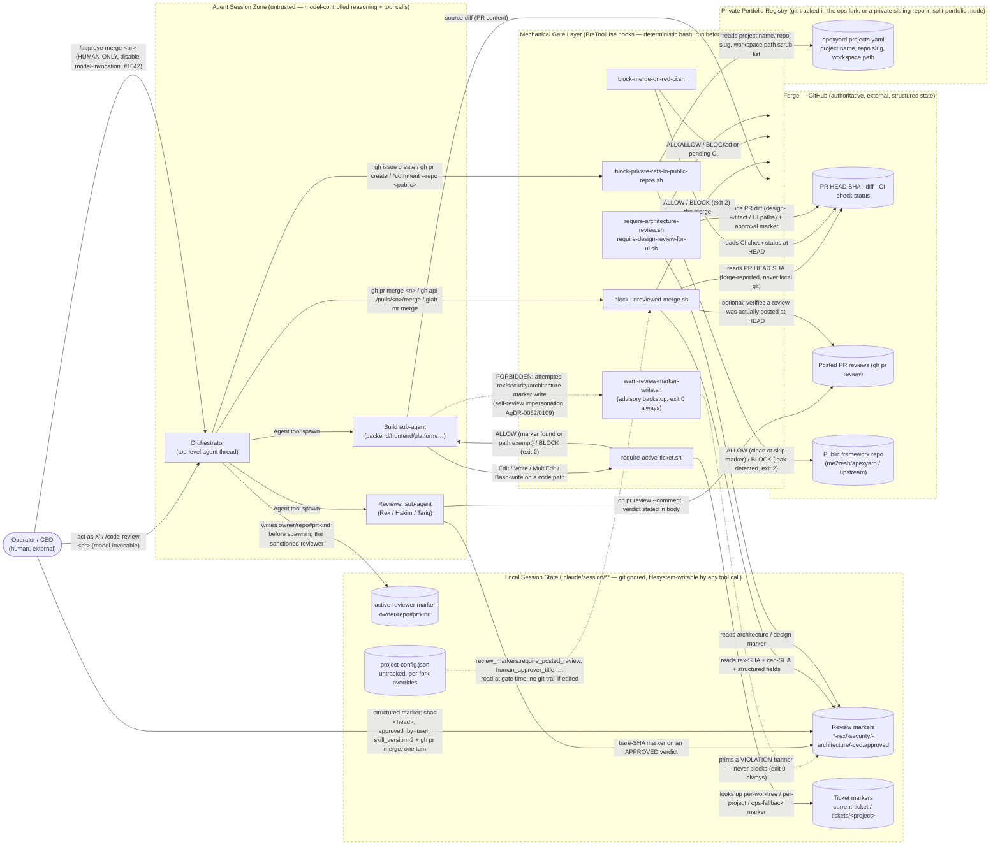

<!-- Source: ApexYard · docs/security/threat-model.md · github.com/me2resh/apexyard · MIT -->

# Threat Model — ApexYard Control Plane

> **Scope note.** This is a threat model of **ApexYard's own SDLC-enforcement machinery** — the
> PreToolUse hooks that gate merges, code edits, and public-repo writes — not of a managed project.
> It tells an adopter what the framework's gates actually guarantee, and, just as importantly, what
> they don't.
>
> **Provenance and AC scope.** Authored manually against issue
> [#1093](https://github.com/me2resh/apexyard/issues/1093), under the recorded **Option D (interim)**
> decision on that issue (see the DFD's Provenance note for the full reasoning). This document, together
> with [`../architecture/dfd.md`](../architecture/dfd.md), satisfies **AC #2** ("the framework's control-plane
> DFD and threat model are reachable by adopters in the public repo") and is written to satisfy **AC #3**
> (the private-by-default rule for managed projects is unaffected — nothing about publishing this
> changes how `/dfd` or `/threat-model` resolve output for a managed project) and **AC #4** (no
> registered private project is named anywhere in this document or its DFD; see "Leak-safety" in the
> Notes below). **AC #1** (a formal AgDR) and **AC #5** (registry expression without bending
> `workspace:`) remain **deferred** — the Option-D issue comment is the recorded interim decision, and
> issue #1093 stays **open** to track them. The automated mechanism (Option A: a `--self`/`--framework`
> flag on the audit skills) is also deferred, not implemented by this document.

## Data Flow Diagram

Source of truth: [`../architecture/dfd.md`](../architecture/dfd.md). Reproduced here, unmodified, per the
template convention of anchoring the STRIDE walk directly against the diagram it's drawn from.

## Attack surface

- **Entry points (~15):** every PreToolUse hook matcher wired in `.claude/settings.json` — `Edit|Write|MultiEdit`
  (ticket gate, migration-ticket gate, role-trigger detection), `Write` (marker-write warn), and a dozen
  `Bash` `if:`-scoped matchers keyed on command shape (`git add`, `git push`, `git commit`, `gh issue
  create`, `gh pr create`, `gh issue/pr comment`, `gh api`, `gh pr merge`, `glab mr merge`, `glab api`,
  `tracker_pr_merge`). Each is a place where the *shape of a shell command string* is the only signal
  the gate has to work with.
- **Data stores (4 classes):** local session-state markers (`.claude/session/reviews/`,
  `.claude/session/active-reviewer`, `.claude/session/tickets/`) — gitignored, filesystem-writable by
  any tool call in the session; the private portfolio registry (`apexyard.projects.yaml`) — git-tracked
  but private-by-convention; per-fork config (`.claude/project-config.json`) — **untracked by design**,
  so edits leave no git trail; and the forge itself (GitHub/GitLab) — the only store in this diagram an
  agent cannot directly write to except through an authenticated, logged API call.
- **External integrations (2):** `gh` (GitHub CLI, first-class) and `glab` (GitLab CLI, parity coverage
  on the merge/CI/design gates, second-class on some flows — e.g. `require_posted_review` is GitHub-only
  today).

## Control vs. backstop classification (AgDR-0104)

Every hook below is labelled in its own source comment (`# CLASS: CONTROL` or no such header, meaning
backstop) per the framework's own naming discipline. Reproduced here as a single table so an adopter
doesn't have to open eight files to see the shape:

| Hook | Class | Why |
|------|-------|-----|
| `block-unreviewed-merge.sh` | **CONTROL** | Decides on structured state — marker SHA vs. forge-reported PR HEAD — not on command text. Fails closed when the forge can't be reached (#1091) or `jq` is missing (#965). |
| `block-merge-on-red-ci.sh` | **CONTROL** | Same shape: forge-reported CI conclusion at HEAD, not text-matched. |
| `require-architecture-review.sh` / `require-design-review-for-ui.sh` | **CONTROL** | Same shape: the PR's real diff from the forge (`gh pr diff`) decides whether the gate applies at all; the marker SHA check is identical to the merge gate's. |
| `require-active-ticket.sh` | **CONTROL** (for its narrow claim) | Marker-existence is structured state (a file present or not), not a text guess — but note its claim is narrow: it proves *a ticket marker was set*, not that the ticket describes the work being done. |
| `warn-review-marker-write.sh` | **BACKSTOP** | Decides by pattern-matching Bash command *text* for a marker-shaped write target. AgDR-0104 states plainly that this class of gate "cannot be made sound" — advisory only, `exit 0` always, since AgDR-0111. |
| `block-private-refs-in-public-repos.sh` | **BACKSTOP** (with real, if imperfect, coverage) | Also a command-text scanner, with the same soundness ceiling — but unlike the marker-write hook it **does** block (`exit 2`) on a detected match. Its own source comments catalogue multiple documented, tested bypass shapes (below) rather than claiming completeness. |
| `block-main-push.sh` | **BACKSTOP-leaning CONTROL** | Reads the actual push destination / commit branch from git and command text, which is more structured than a marker-write guess, but is still ultimately a parse of command text for `cd`/`git push`/`git commit` shapes — its own header documents several rounds of decoy-ref and heredoc-body hardening (#1066, #1075). |

The load-bearing distinction, straight from AgDR-0104: **a control decides on state the agent cannot
author** (a forge API response, a file whose *existence* the gate checks rather than trusting its
content blindly); **a backstop decides on the text of a command**, which — per the ways-to-express-a-path
argument in that AgDR — cannot be made sound against a determined adversary. The framework accepts this
and leans real trust onto the forge-verified controls plus the human-in-the-loop CEO nod, rather than
claiming the backstops are more than they are.

## Threats by STRIDE category

| # | Category | Threat | Severity | Entry point / boundary | Mitigation |
|---|---|---|---|---|---|
| T1 | Spoofing | A build sub-agent writes a `*-rex.approved` marker to impersonate a real Rex review it never ran (self-review, AgDR-0062's original finding) | **High** | Build sub-agent → Review markers store (crossing #4/#5 in the DFD trust-boundary table) | **[BACKSTOP]** `warn-review-marker-write.sh` prints a visible banner but never blocks. **[CONTROL, weaker]** the opt-in `review_markers.require_posted_review` (AgDR-0112, default **off**, GitHub-only) verifies a review was actually posted at HEAD — but accepts a review from the PR's own author, so it is explicitly **not** separation of duties (AgDR-0062's independent-reviewer version stays deferred as unsatisfiable single-account). **[CONTROL]** the merge still cannot complete without a *separate* CEO marker. |
| T2 | Spoofing | A build sub-agent forges the human-only CEO marker to self-approve a merge | **Critical (if it worked) / Low (as shipped)** | Any agent → Review markers store | **[CONTROL]** the marker requires structured fields (`sha=`, `approved_by=user`, `skill_version>=2`) the model *can* type but only by committing a deliberate, visible rule violation; the real control is that `/approve-merge` itself is `disable-model-invocation: true` (#1042) — the model has **no tool path** to invoke the skill that legitimately writes this marker. |
| T3 | Spoofing | An agent claims a ticket is active by writing a fabricated ticket marker to bypass `require-active-ticket.sh` | Medium | Build sub-agent → Ticket markers store | **[BACKSTOP]** the gate checks marker *existence*, not that the referenced ticket is real or open — an agent that can write the marker file can satisfy the gate with a fictitious ticket ID. The actual defense is that `require-skill-for-issue-create.sh` gates ticket *creation* through structured skills, and human review of the resulting PR would surface a nonsense ticket reference. |
| T4 | Tampering | A stale approval (SHA for an old commit) is presented against a PR that has since moved | High | Merge gates → Review markers store + Forge PR HEAD | **[CONTROL]** every SHA comparison is against the forge-reported HEAD (`resolve_pr_head`), never local git; a mismatch blocks with an explicit "new commits pushed after approval" message. |
| T5 | Tampering | The merge gate falls back to a locally-controlled HEAD value when the forge is unreachable, letting an agent-influenced value substitute for the forge's | High (historical) / **Closed** | Merge gates → Forge | **[CONTROL]** closed by #1091 (and its sibling fix landed the same day per the repo's recent commit history): the gate now **blocks** rather than falling back to local git when `resolve_pr_head` fails. This is the single most consequential fix in this hook family — a silent fallback here would have voided every SHA comparison above it. |
| T6 | Tampering | `sed -i` / `awk -i inplace` rewrites a marker file's SHA in place to match a new HEAD, defeating "new commits invalidate approval" | Medium | Build sub-agent → Review markers store, via an in-place edit rather than a fresh write | **[BACKSTOP, partial]** `warn-review-marker-write.sh`'s own comments document this exact BSD-`sed -i` two-token extraction hazard and the fix that scoped a fallback scan to catch it — but the hook is still advisory-only; nothing blocks the edit. **[CONTROL, downstream]** the merge gate re-derives the forge HEAD independently at merge time, so a stale-then-rewritten marker only succeeds if the rewritten SHA happens to equal the *current* real HEAD — i.e., the tamper has to be accurate, not just present. |
| T7 | Tampering | An agent edits `.claude/project-config.json` to set `review_markers.require_posted_review` back to `false` (or weaken `human_approver_title`, protected branches, etc.) after an operator turned a control on | Medium–High | `project-config.json` → any gate that reads it | **[GAP, documented]** the file is untracked by design (so per-fork overrides survive `/update`), which means an edit here **leaves no git trace** — AgDR-0112 states this plainly. No control in this diagram detects config tampering; it is a genuine, accepted residual risk of the untracked-config design. |
| T8 | Repudiation | "A review happened" is only a local file's existence — nothing forces it to correspond to a real, readable review comment | Medium | Reviewer sub-agent → Review markers store | **[CONTROL, opt-in]** `review_markers.require_posted_review` (default off) makes this forge-verifiable — but it's off by default and GitHub-only; on a fresh fork or a GitLab adopter, this is unmitigated by default. |
| T9 | Repudiation | Local session markers carry no timestamp binding them to a specific reviewer identity or session | Low | Review markers store (all writers) | **[GAP, accepted]** the CEO marker carries an *optional* `approved_at` field the skill writes but the gate does not validate — an audit convenience, not a checked property. |
| T10 | Information disclosure | A registered private project's name, repo slug, or workspace path leaks into a public framework-repo issue/PR/comment | High | Any agent → Leak-protection gate → Public repo | **[BACKSTOP, real but bounded]** `block-private-refs-in-public-repos.sh` blocks on detection — stronger than the marker-write backstop because it actually exits 2 — but its own source comments catalogue multiple confirmed-against-`upstream/dev` bypass shapes that are **not** fixed: (a) two real writes chained in one Bash call where the leak sits in an earlier write and a later write's `--repo` names a different repo; (b) the `--repo=owner/name` equals-form, unrecognised by either matcher; (c) a repo slug in different case; (d) a slug immediately followed by a shell operator with no separating whitespace; (e) a `gh api` REST path with a trailing `?query` suffix. All five are filed as a documented follow-up, not silently undiscovered. |
| T11 | Information disclosure | A body-file (`--body-file`) or `gh api` payload contains a leak that the hook can't read (unreadable path, wrong cwd) | Medium | Leak-protection gate | **[CONTROL for this sub-case]** the hook explicitly distinguishes "no body-file" from "body-file I could not read" and **refuses** (blocks) rather than silently scanning nothing — closing what used to be a silent-leak path. |
| T12 | Information disclosure | Stack traces / hook internals / marker paths leak into a PR or issue body incidentally (e.g. pasting a debug log) | Low | Any write path | **[GAP]** no control specifically strips debug output from ticket/PR bodies; this relies on author self-discipline, same as the framework's general "no hardcoded secrets" rule (`check-secrets.sh` covers credential-shaped strings, not arbitrary internal-state leakage). |
| T13 | Denial of service | `jq` is missing from `PATH` at merge time | Medium | Every merge gate (all four) | **[CONTROL, by design]** each gate falls back to a `jq`-independent raw-text scan; if the raw payload *looks* merge-shaped, the gate blocks (`exit 2`) rather than silently allowing an unverified merge. This is a deliberate fail-closed trade: an unrelated tooling problem can block all merges in the session until fixed. `check-jq-installed.sh` warns at `SessionStart` to reduce how often this is discovered mid-merge. |
| T14 | Denial of service | The forge (GitHub/GitLab) is unreachable — network failure, expired token, rate limit | Medium–High | Merge gates → Forge | **[CONTROL, by design, since #1091]** blocks rather than silently falling back to a locally-controlled value. Correct security posture; explicit availability cost — every merge stalls until connectivity or auth is restored. |
| T15 | Denial of service | A malformed heredoc, decoy ref, or chained shell command is used to make `block-main-push.sh` mis-scan and either false-block a legitimate push or (worse) miss a real one | Low (false-block) / High (missed real push) | `git push`/`git commit` → `block-main-push.sh` | **[BACKSTOP, heavily hardened]** the hook's own history (#1066, #1075, and several later review rounds) documents at least three prior true bypasses found and closed by widening the raw-text scan to check every push-shaped occurrence, not just the first. AgDR-0113 ("heredoc-stripper additive-only") governs how much stripping is safe. Given AgDR-0104's general claim, further bypasses in this family should be assumed possible, not ruled out. |
| T16 | Elevation of privilege | `gh api repos/<o>/<r>/pulls/<n>/merge` used instead of `gh pr merge` to route around a gate that only recognised the CLI-subcommand shape | High (historical) / **Closed** | Any agent → Merge gates | **[CONTROL]** closed by #47; all four merge-relevant gates (`block-unreviewed-merge.sh`, `block-merge-on-red-ci.sh`, `require-architecture-review.sh`, `require-design-review-for-ui.sh`) match both the `gh pr merge` and `gh api .../merge` shapes, plus the `glab` equivalents and the `tracker_pr_merge` wrapper (dispatched via registry lookup rather than text, since the wrapper's own text never says "gh" or "glab" by design). |
| T17 | Elevation of privilege | An out-of-governance write target (a symlink, a path outside the ops fork and every registered workspace, or a target with no git repo in its ancestry) is used to smuggle a code change past `require-active-ticket.sh` | Medium | Build sub-agent → Ticket gate | **[CONTROL, narrow and deliberate]** the out-of-governance exemption (#883/#885) resolves symlinks *before* judging containment, and checks containment on both the raw and resolved path — closing the specific "workspace entry is itself a symlink pointing outside" hole a security review found. The exemption is intentionally narrow: any path inside *some* git repo (even an unregistered one) is NOT exempted, only genuinely out-of-governance targets are. |
| T18 | Elevation of privilege | A ticket-first bypass via an unextractable Bash write target (e.g. `python -c '...write...'`) | Low | Build sub-agent → Ticket gate | **[CONTROL]** an empty/unextractable `FILE_PATH` is *never* exempted — it falls straight through to the ticket gate and blocks, categorically fail-closed. |
| T19 | Elevation of privilege | Silent config drift weakens a gate's protected-branch list, migration paths, UI paths, or design paths via `.claude/project-config.json` overrides that REPLACE rather than extend the default list | Medium | `project-config.json` → any path-glob-driven gate | **[GAP, by design trade-off]** most of these keys are documented as REPLACE semantics (not additive), and an operator who overrides `.git.protected_branches[]` and forgets an entry silently un-protects a branch. The `_exclude` sibling keys (`ui_paths_exclude`, `design_paths_exclude`) exist specifically to let an adopter keep the safe defaults while carving out exceptions — using the REPLACE form instead of the exclude form is a footgun the docs warn about but do not prevent. |

## Recommended priority

Ordered by realistic exploitability × blast radius, not raw severity — a Critical threat with no
practical exploit path (T2) ranks below a High threat with a documented, working bypass (T5's historical
form, T10):

1. **T7 — untracked config tampering.** No detection exists at all; this is the single largest *actual*
   gap in the diagram, not a "this could theoretically be forged" caveat. Worth a follow-up: even an
   advisory diff-against-last-known-good check at `SessionStart` would close the visibility gap without
   re-introducing the drift-vs-portability trade-off that made the file untracked in the first place.
2. **T10 — leak-protection bypass shapes.** Five documented, reproduced-against-`upstream/dev` gaps in
   one hook. Each is individually narrow, but they are catalogued, not hypothetical — a natural next PR
   for whoever picks up the follow-up ticket referenced in the hook's own comments.
3. **T1/T8 — marker forgery / unverifiable review.** Already has a real, if opt-in and single-directional,
   mitigation (`require_posted_review`). Consider defaulting it **on** for adopters who have configured a
   separate reviewer/bot identity, where it would deliver actual separation of duties rather than the
   weaker "a review exists" property it provides today.
4. **T13/T14 — availability cost of fail-closed.** Not a vulnerability to fix — a trade-off to document
   loudly so adopters aren't surprised when a `gh` auth expiry blocks every merge in the fork.
5. Everything else — closed, bounded, or accepted with documented rationale.

## Framework-specific cross-check

This system is a CLI/hook harness, not a web application, so the standard OWASP web checklist doesn't
map cleanly. The adapted equivalents that do apply:

- [x] **Command injection in hooks** — every hook reads `.tool_input.command` via `jq -r`, then parses
  with `grep`/`sed`/`awk` rather than `eval`ing untrusted text directly. The one deliberate `eval` in the
  tracker library (`_tracker_create_custom` / `_tracker_list_custom`) is scoped to **operator-authored**
  `custom` command templates, with untrusted values (title/body/labels) passed via environment variables
  rather than string-substituted into the eval'd command — documented explicitly in `_lib-tracker.sh` as
  the injection model.
- [x] **Path traversal / symlink escape in marker resolution** — `_resolve_real_path` is used before
  judging out-of-governance containment (T17); a registered workspace entry that is itself a symlink
  pointing outside `workspace/` is still caught via the raw-path check alongside the resolved-path check.
- [~] **TOCTOU on marker files** — a marker's SHA is read, then compared; between the read and the
  `gh pr merge` execution there is a small window where a concurrent session could rewrite the marker.
  Not analyzed in depth here; likely low-impact given the single-operator-session model this framework
  assumes, but worth a note for anyone running concurrent fan-out agents against the same PR.
- [x] **Dependency on external CLIs (`jq`, `gh`, `glab`, `yq`)** — `jq` is treated as a hard prerequisite
  with an explicit `SessionStart` check (`check-jq-installed.sh`) and fail-closed behavior everywhere
  else; `yq` has a documented `python3`+PyYAML fallback in the tracker library.
- [ ] **Secrets in logs** — not evaluated in this pass; the hooks print diagnostic messages to stderr
  including PR numbers, SHAs, and file paths, none of which are secret-class, but this was not
  independently verified against every hook's error-path output.

## Notes

**Leak-safety.** No registered private project's name, repo slug, or workspace path appears anywhere in
this document or its paired DFD. Every example uses the generic placeholder `<managed-project>` or refers
to registry fields abstractly ("a registered private project"). This document was authored without ever
reading the fork's actual `apexyard.projects.yaml` contents, so there was nothing to leak by construction.

**What "STRIDE-complete" does not mean here.** This walk is anchored on the DFD's boundary crossings and
the hooks that guard them, but it is not an exhaustive enumeration of every hook in `.claude/hooks/`
(there are 49). It covers the control-plane core the task scoped: the merge-approval flow, the
marker-forgery surface, the ticket gate, and the leak-protection boundary. `check-secrets.sh`,
`validate-branch-name.sh`, `validate-pr-create.sh`, `require-migration-ticket.sh`, and the various
`SessionStart` advisory hooks are real parts of the trust chain not walked in depth here.

**Relationship to AgDR-0104's deferred items.** That AgDR explicitly deferred two things until their
triggers fire: a CI meta-gate that fails the build if any trust-chain hook lacks a paired adversarial
test (trigger: a third independent bypass incident), and a full compliance mapping to ISO/SOC2/SLSA
(trigger: an adopter compliance request). Neither trigger is known to have fired as of this document's
authoring; both remain open per that AgDR, not resolved by this one.

**On this document's own honesty.** Following the same discipline the framework's hooks apply to
themselves (AgDR-0104 § "name principles honestly"): this is a **threat model**, not a penetration test
report and not a compliance attestation. Several rows above are marked `[GAP]` deliberately rather than
rounded up to `[CONTROL]` or `[BACKSTOP, closed]` — the honest state of a residual risk is more useful to
an adopter than an inflated claim of coverage.

---

## References

- [`../architecture/dfd.md`](../architecture/dfd.md) — the DFD this threat model is anchored on
- [`../agdr/AgDR-0104-trust-chain-controls-vs-backstops.md`](../agdr/AgDR-0104-trust-chain-controls-vs-backstops.md)
- [`../agdr/AgDR-0062-rex-marker-authenticity.md`](../agdr/AgDR-0062-rex-marker-authenticity.md)
- [`../agdr/AgDR-0112-verify-posted-review-at-head.md`](../agdr/AgDR-0112-verify-posted-review-at-head.md)
- [`../../.claude/rules/pr-workflow.md`](../../.claude/rules/pr-workflow.md)
- [`../../.claude/rules/workflow-gates.md`](../../.claude/rules/workflow-gates.md)
- [`../../.claude/rules/leak-protection.md`](../../.claude/rules/leak-protection.md)
- Issue [#1093](https://github.com/me2resh/apexyard/issues/1093) — the driver for this document, and the
  Option-D interim decision this document's provenance note describes
- [STRIDE — Microsoft Security Development Lifecycle](https://learn.microsoft.com/en-us/azure/security/develop/threat-modeling-tool-threats)
